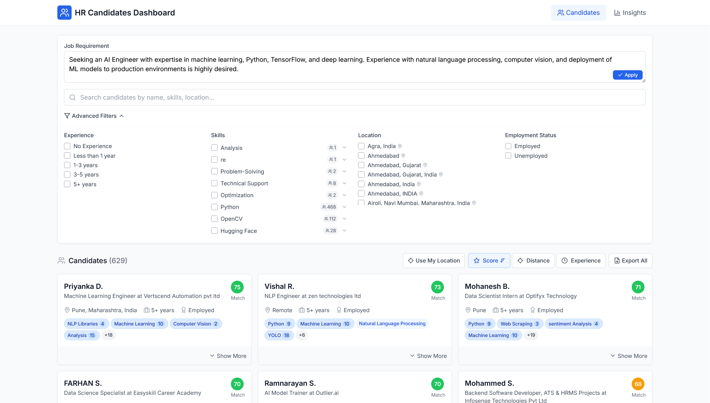
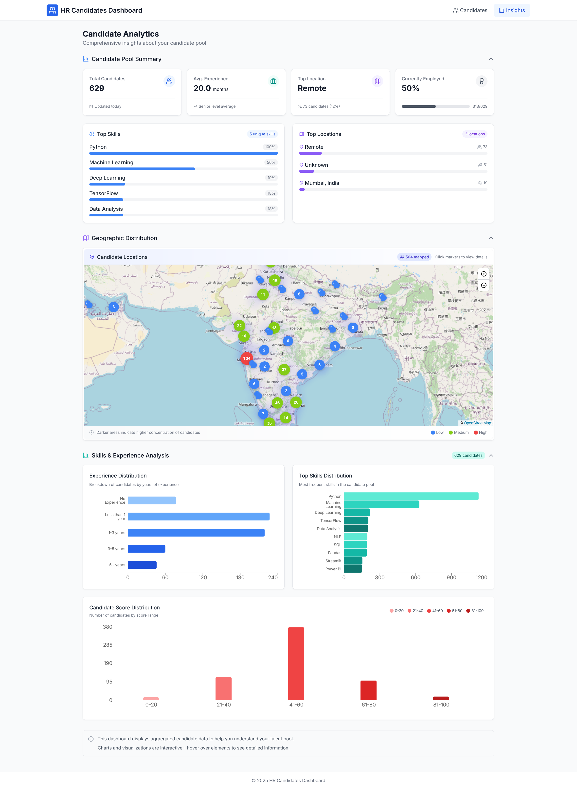

# SmartHire – AI-Powered Candidate Evaluation Dashboard

A modern, responsive React + TypeScript web application built to streamline the candidate evaluation process for HR teams and hiring managers. SmartHire enables filtering, ranking, and analyzing thousands of resumes using intelligent matching algorithms and insightful visualizations.

This project was developed by **Joshua Cohen** to demonstrate full-stack UI architecture, data-driven filtering, and component-based design using React and Tailwind CSS.

---

## 📸 Screenshots

### 🎯 Candidate Dashboard  


### 📊 Insights & Analytics  


---

## ✨ Key Features

- 📄 **Resume Parsing**: Upload resumes to extract structured candidate data
- 📌 **Advanced Filtering**: Filter by skills, experience level, work type, and more
- 🧠 **AI-Powered Relevance Matching**: Matches candidates to job descriptions using TF-IDF algorithms
- 🧩 **Skill Normalization**: Groups similar skill terms like `React`, `ReactJS`, and `React.js`
- 📍 **Location-Aware Sorting**: Sort candidates by distance from a target location
- 📊 **Data Visualizations**: View trends in experience, skill distribution, and employment type
- 🌗 **Responsive UI + Dark Mode**: Works seamlessly on desktop and mobile devices

---

## 🧪 Technology Stack

- **Framework**: React 18 + TypeScript
- **Styling**: Tailwind CSS
- **Routing**: React Router v6
- **Charts**: Recharts
- **Icons**: Lucide React
- **Date Utilities**: date-fns
- **Build Tool**: Vite

---

## 📁 Project Structure

```
src/
├── components/ - Reusable UI components
│   ├── dashboard/ - Dashboard-specific components
│   ├── insights/ - Data visualization components
│   └── layout/ - Layout components like header, sidebar
├── data/ - Data fetching and manipulation
├── pages/ - Top-level page components
│   ├── Dashboard.tsx - Main candidate browsing page
│   └── Insights.tsx - Analytics and data visualization page
├── types/ - TypeScript type definitions
├── utils/ - Utility functions
│   ├── filterUtils.ts - Filtering and sorting logic
│   ├── skillNormalizationUtils.ts - Skill grouping logic
│   └── tfidfUtils.ts - Text matching algorithms
└── App.tsx - Main application component
```

## 🚀 Getting Started

### 📦 Prerequisites

- Node.js v14 or higher
- npm or yarn

### ⚙️ Setup

```bash
git clone https://github.com/jocodev0509/smarthire-dashboard.git
cd smarthire-dashboard
npm install    # or yarn install
npm run dev    # or yarn dev
```
## 🛠️ Build for Production
```bash
Copy
Edit
npm run build
# or
yarn build
```
The optimized output will be in the /dist directory.

## ☁️ Deployment
This app is ready to deploy on platforms like Vercel, Netlify, or GitHub Pages.
A live version is available at:

🔗 smarthire.vercel.app <!-- Replace with your actual Vercel link -->

## 🔒 Data Source
Candidate data is simulated or generated from uploaded resumes and includes:

Name and contact info

Work experience

Skills and projects

Location and availability

## 👨‍💻 Author

**Joshua Cohen**  
Full-stack developer focused on building scalable, intuitive web applications.  
GitHub: [@jocodev0509](https://github.com/jocodev0509)

## 📄 License
This project is licensed under the MIT License.
```
yaml
Copy
Edit

---

Let me know if you'd like:
- A downloadable `.md` file
- Your screenshot filenames adjusted
- Help adding a **dark mode toggle** or **new feature** to show in your demo